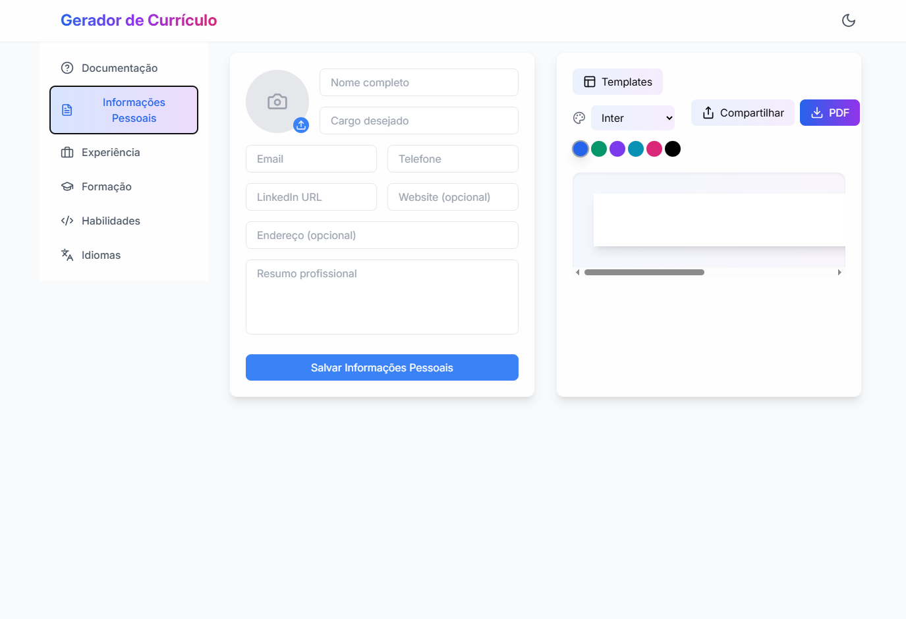

# Gerador de Currículo

Uma ferramenta moderna e profissional para criar currículos impressionantes, totalmente gratuita e sem necessidade de cadastro.



## 🚀 Características Principais

- **Múltiplos Templates**: Escolha entre diversos modelos profissionais e personalizáveis para seu currículo
- **Privacidade Garantida**: Seus dados nunca são armazenados em servidores externos
- **Exportação em PDF**: Exporte seu currículo em PDF com alta qualidade

## 🔒 Privacidade e Segurança

Nossa aplicação foi projetada com sua privacidade em mente:

- **Processamento Local**: Todos os dados são processados localmente no seu navegador
- **Sem Armazenamento**: Não armazenamos nenhuma informação em servidores externos
- **Sem Cookies**: Não utilizamos cookies de rastreamento
- **Sem Cadastro**: Não é necessário criar conta ou fornecer dados pessoais

## 💻 Tecnologias Utilizadas

- React com TypeScript
- Tailwind CSS
- Zustand para gerenciamento de estado
- React Hook Form
- html2canvas e jsPDF

## ✨ Funcionalidades

- Múltiplos templates de currículo
- Personalização de cores e fontes
- Modo escuro
- Layout responsivo
- Exportação em PDF
- Compartilhamento direto (em dispositivos compatíveis)

## 🛠️ Instalação e Uso

1. Clone o repositório:
```bash
git clone https://github.com/MateusCamargoS-1/resume-builder.git
```

2. Instale as dependências:
```bash
cd resume-builder
npm install
```

3. Inicie o servidor de desenvolvimento:
```bash
npm run dev
```

4. Abra [http://localhost:5173](http://localhost:5173) no seu navegador

## 📱 Armazenamento de Dados

A aplicação utiliza o localStorage do navegador para salvar temporariamente suas alterações durante a sessão. Estes dados são completamente removidos ao fechar o navegador. Nenhum dado é enviado ou armazenado em servidores externos.

## ⚠️ Limitações

- A qualidade da foto do perfil depende da resolução original da imagem
- O layout do PDF pode variar ligeiramente dependendo do visualizador
- Algumas fontes podem não estar disponíveis em todos os sistemas

## 📄 Termos de Uso

Ao utilizar nossa aplicação, você concorda com os seguintes termos:

1. A aplicação é fornecida "como está", sem garantias de qualquer tipo
2. Você é responsável pelo conteúdo que inclui em seu currículo
3. O uso da aplicação é gratuito e para fins não comerciais
4. Não nos responsabilizamos por perda de dados durante o uso da aplicação
5. Você concorda em não usar a aplicação para fins ilegais ou não autorizados

## 🤝 Contribuindo

Contribuições são bem-vindas! Por favor, leia as [diretrizes de contribuição](CONTRIBUTING.md) antes de enviar um pull request.

## 📝 Licença

Este projeto está licenciado sob a [MIT License](LICENSE).
